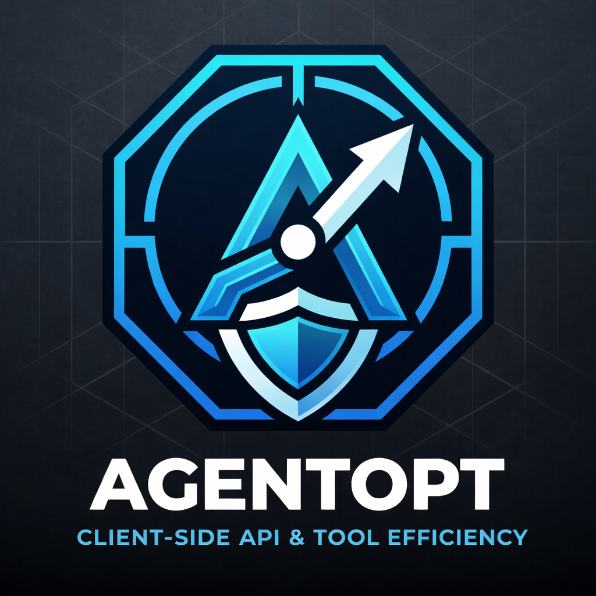

<p align="center">
  
</p>

<p align="center">
  <strong>Find the right LLM models for your AI agents.</strong>
</p>

<p align="center">
  <em>A simple model swap can cut your agent's costs by 10–100x without sacrificing performance.</em>
</p>

<p align="center">
  <a href="https://pypi.org/project/agentopt-py/"></a>
  <!-- <a href="https://pepy.tech/projects/agentopt-py"></a> -->
  <!-- <a href="https://github.com/AgentOptimizer/agentopt"></a> -->
  <a href="https://github.com/AgentOptimizer/agentopt/blob/main/LICENSE"></a>
  <a href="https://agentoptimizer.github.io/agentopt/"></a>
</p>

<p align="center">
  AgentOpt is supported by <a href="https://daplab.cs.columbia.edu/">DAPLab</a> at Columbia University.
</p>

---

## News
[2026/05] 🔥 Per-call **routing** and a long-lived **`agentopt serve` daemon** shipped! Pick a different model on every LLM call, or point any number of clients at one shared gateway with `AGENTOPT_GATEWAY_URL`.

[2026/04] Version 0.1.0 released.


## Why AgentOpt

**Framework-agnostic by construction.** AgentOpt intercepts LLM calls at the one place every SDK eventually goes through — the outbound HTTP request — so it works the same with anything that ships an LLM call over the wire. No framework adapters, no plugin per provider, no wrapping your client. In-process Python frameworks (LangChain, LangGraph, CrewAI, LlamaIndex, AG2, OpenAI Agents SDK, plain `openai`/`anthropic`) attach through an `httpx` patch; subprocess and CLI agents (Claude Code, Gemini CLI, OpenHarness, Terminal Bench, OpenClaw) attach through `HTTPS_PROXY` with a local CA. The same code works on both — and on anything custom you write tomorrow.

On top of that one primitive, AgentOpt gives you three capabilities that share the same proxy, the same record schema, and the same cache:

- **Selection** — search a combinatorial model space to find the best fixed combination for an agent.
- **Routing** — swap models *per call* at runtime based on prompt, history, or any policy you write.
- **Tracking** — just record token usage, latency, and per-query cost across an agent run.

The combinatorial search problem is real: 3 steps × 8 models = **512 combinations** to evaluate. AgentOpt's selection algorithms (arm elimination, LUCB, Bayesian) home in on the best combination with a fraction of the brute-force cost, and the routing API lets you keep refining at runtime once you've shipped.

## Use Cases

### Offline model selection — find the best fixed combination

Same accuracy band, 20–100x cost difference — just by picking the right model combination:

| Benchmark | Expensive Combo | Acc | Cost | Budget Combo | Acc | Cost | Savings |
|-----------|----------------|-----|------|-------------|-----|------|---------|
| BFCL | Opus | 72% | $60.78 | Qwen3 Next | 71% | $1.87 | **32x** |
| HotpotQA | Opus + Opus | ~73% | $2.71 | Qwen3 Next + gpt-oss-120b | 71.3% | $0.13 | **21x** |
| MathQA | Opus + Opus | ~98.5% | $5.89 | Ministral + C3 Haiku | 94.0% | $0.05 | **118x** |

Run it once against a small evaluation dataset; ship the winner. Read more in our [blog post](https://agentoptimizer.github.io/agentopt/blog/2026/03/22/why-your-agent-needs-a-model-combo-optimizer-not-just-a-model/).

### Online model routing — pick a different model per call

For workloads where one fixed combination isn't optimal — easy prompts shouldn't pay GPT-4o prices, hard ones shouldn't suffer on Haiku — a `Router` decides at every LLM call which model to use, based on the prompt, prior calls in the session, or any feature you can compute. Common policies:

- **Length/complexity-based** — short prompts → small model, long context or tool-call-heavy → big model.
- **First-call-big** — a strong model for the planning hop, cheap models for the follow-ups.
- **Bandit / learned routing** — feed selection results back into a contextual bandit so routing decisions improve with traffic.
- **Provider failover & A/B** — route a fraction of traffic to a candidate model for live comparison without redeploying.

The routing API runs the same in-process or through the `agentopt serve` daemon, so you can prototype locally and switch a single env var to share the policy across many clients.

## Installation

```bash
pip install agentopt-py
```
## Quick Start

The two entry points share the same proxy and the same agent shape — pick selection when you want to find one fixed combination offline, pick routing when you want to swap models per call at runtime. The agent class below is reused by both.

```python
from openai import OpenAI

class MyAgent:
    def __init__(self, models):
        self.client = OpenAI()
        self.planner_model = models["planner"]
        self.solver_model = models["solver"]

    def run(self, input_data):
        plan = self.client.chat.completions.create(
            model=self.planner_model,
            messages=[{"role": "user", "content": f"Plan: {input_data}"}],
        ).choices[0].message.content

        answer = self.client.chat.completions.create(
            model=self.solver_model,
            messages=[
                {"role": "system", "content": f"Follow this plan:\n{plan}"},
                {"role": "user", "content": input_data},
            ],
        ).choices[0].message.content
        return answer
```

### 1. Offline model selection

Find the best fixed `{planner, solver}` combination against an evaluation dataset:

```python
from agentopt import ModelSelector

dataset = [
    ("What is the capital of France?", "Paris"),
    ("What is 2 + 2?", "4"),
    ("What color is the sky?", "blue"),
    # 100+ samples recommended for production decisions;
    # 10-20 already surfaces clear winners during development.
]

def eval_fn(expected, actual):
    return 1.0 if expected.lower() in str(actual).lower() else 0.0

selector = ModelSelector(
    agent=MyAgent,
    models={
        "planner": ["gpt-4o", "gpt-4o-mini", "gpt-4.1-nano"],
        "solver":  ["gpt-4o", "gpt-4o-mini", "gpt-4.1-nano"],
    },                                  # → 3 × 3 = 9 combinations
    eval_fn=eval_fn,
    dataset=dataset,
    method="auto",                      # arm_elimination — smart + cheap
)

results = selector.select_best(parallel=True, max_concurrent=50)
results.print_summary()
```

Output:
```
    Model Selection Results
    ----------------------------------------------------------------------------
    Rank  Model                                     Accuracy  Latency      Price
    ----------------------------------------------------------------------------
>>>    1  planner=gpt-4.1-nano + solver=gpt-4.1-nano 100.00%    0.85s  $0.000420
       2  planner=gpt-4o-mini + solver=gpt-4o-mini   100.00%    1.20s  $0.002372
       3  planner=gpt-4o + solver=gpt-4o              100.00%    2.70s  $0.014355
    ...
```

LLM-as-judge is also supported — just call your judge LLM inside `eval_fn`. With `method="auto"` (default) AgentOpt eliminates clearly worse combinations after just a few datapoints instead of evaluating every combo on every datapoint.

### 2. Online model routing

Same agent, no `models=` search space, no dataset — instead a `Router` decides per call:

```python
from agentopt import LLMTracker, RandomRouter

# Instantiate the agent once; the router overrides the model on each LLM call.
agent = MyAgent({"planner": "gpt-4o-mini", "solver": "gpt-4o-mini"})

router = RandomRouter(candidates=["gpt-4o-mini", "gpt-4.1-nano"], seed=0)
questions = [
    "What is the capital of France?",
    "What is 2 + 2?",
    "What color is the sky?",
]

with LLMTracker(router=router) as tracker:
    for i, q in enumerate(questions, 1):
        with tracker.track(data_id=f"q{i}"):
            print(agent.run(q))
tracker.print_summary()
```

Output:
```
Paris
4
Blue.
============================================================
Routing summary
============================================================

Model usage by datapoint:
  [q1]  2 call(s), 4.11s
      gpt-4.1-nano                     2.06s
      gpt-4.1-nano                     2.06s
  [q2]  2 call(s), 2.22s
      gpt-4.1-nano                     1.11s
      gpt-4.1-nano                     1.11s
  [q3]  2 call(s), 6.03s
      gpt-4o-mini                      3.01s
      gpt-4o-mini                      3.01s

Tokens per model:
  gpt-4.1-nano   prompt= 19268   completion=     8   total= 19276
  gpt-4o-mini    prompt=  9638   completion=     6   total=  9644

Total latency: 12.37s across 6 call(s)
```

`RandomRouter` is the simplest built-in policy. Write your own by subclassing `Router` and implementing `route(ctx) -> Optional[str]` — return a model name to swap or `None` to keep the client's choice. See the [router docs](https://agentoptimizer.github.io/agentopt/api/router/) for context fields (history, prompt, session) and the [`examples/routing/`](examples/routing/) folder for length-based, first-call-big, and bandit policies.

### What you provide

Both entry points share the same agent contract:

- `MyAgent.__init__(self, models)` — receive a dict like `{"planner": "gpt-4o", "solver": "gpt-4o-mini"}` and build your agent. For routing, the dict is the *initial* model assignment; the router can override on any individual LLM call.
- `MyAgent.run(self, input_data)` — run on a single datapoint and return the output.

Selection additionally needs a `dataset` of `(input, expected)` pairs and an `eval_fn(expected, actual) -> float` — neither is required for routing.

## Framework Compatibility

Working examples for the frameworks and CLI agents named above. Examples are organised into four quadrants under [`examples/`](examples/): `{selection, routing} × {local, daemon}`.

| Framework | Type | Selection | Routing |
|-----------|------|-----------|---------|
| OpenAI Agents SDK | in-process | [openai_sdk.py](examples/selection/local/openai_sdk.py) | [openai_sdk.py](examples/routing/local/openai_sdk.py) |
| LangChain | in-process | [langchain.py](examples/selection/local/langchain.py) | [langchain.py](examples/routing/local/langchain.py) |
| LangGraph | in-process | [langgraph.py](examples/selection/local/langgraph.py) | [langgraph.py](examples/routing/local/langgraph.py) |
| CrewAI | in-process | [crewai.py](examples/selection/local/crewai.py) | [crewai.py](examples/routing/local/crewai.py) |
| LlamaIndex | in-process | [llamaindex.py](examples/selection/local/llamaindex.py) | [llamaindex.py](examples/routing/local/llamaindex.py) |
| AG2 | in-process | [ag2.py](examples/selection/local/ag2.py) | [ag2.py](examples/routing/local/ag2.py) |
| OpenAI-Compatible API | in-process | [custom_agent.py](examples/selection/local/custom_agent.py) | [custom_agent.py](examples/routing/local/custom_agent.py) |
| Gemini CLI | subprocess | [gemini_cli.py](examples/selection/local/gemini_cli.py) | [gemini_cli.py](examples/routing/local/gemini_cli.py) |
| OpenHarness | subprocess | [openharness.py](examples/selection/local/openharness.py) | [openharness.py](examples/routing/local/openharness.py) |
| Terminal Bench | subprocess (Docker) | [terminal_bench.py](examples/selection/local/terminal_bench.py) | [terminal_bench.py](examples/routing/local/terminal_bench.py) |
| OpenClaw | subprocess | [openclaw.py](examples/selection/local/openclaw.py) | [openclaw.py](examples/routing/local/openclaw.py) |

## Selection Algorithms

AgentOpt includes a rich set of selection algorithms. Advanced users may get significant speedups by choosing the right method for their use case. See the [documentation](https://agentoptimizer.github.io/agentopt/) and [advanced_algorithms.py](examples/selection/local/advanced_algorithms.py) for details.

If you do not need the strict best model combination and want **lower search cost**, `epsilon_lucb` is often a good choice: it stops once an **ε-optimal** arm is found (tune `epsilon` to trade off how close to optimal you need to be versus how many runs you spend).

| `method=` | Best for | How it works |
|-----------|----------|-------------|
| `"auto"` (default) | General use | Automatically finds the best combination (wired to `arm_elimination` — strong best-arm identification with lower search cost than `brute_force`) |
| `"brute_force"` | Small search spaces | Evaluates all combinations |
| `"random"` | Quick exploration | Samples a random fraction |
| `"hill_climbing"` | Topology-aware search | Greedy search using model quality/speed rankings |
| `"arm_elimination"` | Best-arm identification | Bandit; eliminates statistically dominated combinations |
| `"epsilon_lucb"` | Extra search cost savings when ε-optimal is enough | Bandit; stops when an epsilon-optimal best arm is identified |
| `"threshold"` | Thresholding objectives | Bandit; determines whether each combination is above/below a user-defined `threshold` on the performance metric (e.g., mean accuracy) |
| `"lm_proposal"` | LLM-guided search | Uses a proposer LLM to shortlist promising combinations |
| `"bayesian"` | Expensive evaluations | GP-based Bayesian optimization over categorical model choices; uses correlation between combinations (requires `pip install "agentopt-py[bayesian]"`) |

```python
selector = ModelSelector(
    agent=MyAgent, models=models, eval_fn=eval_fn, dataset=dataset,
    method="epsilon_lucb",
    epsilon=0.01
)
results = selector.select_best(parallel=True)
```

## How It Works

AgentOpt intercepts LLM calls at the `httpx` transport layer — the one chokepoint every LLM SDK shares. No proxy server, no framework adapters required.

```
your_agent(input)
  └── framework internals (LangChain, CrewAI, etc.)
        └── httpx.Client.send()   ← intercepted here
              └── LLM API (OpenAI, Anthropic, etc.)
```

For each model combination, AgentOpt:
1. Instantiates your agent class with the candidate models
2. Calls `run()` on every datapoint in your evaluation set
3. Tracks token usage, latency, and per-query cost automatically
4. Scores the output using your evaluation function
5. Reports the Pareto-optimal combinations

Response caching (in-memory + SQLite on disk) is enabled by default — identical LLM calls are never repeated, making iterative experimentation fast and cheap.

### Subprocess / External Agents (Claude Code, Gemini CLI, Terminal Bench, OpenClaw, …)

For agents that run as **external processes** (not in-process Python), AgentOpt uses a localhost HTTP proxy with TLS interception via a local CA certificate. The subprocess's LLM calls route through the proxy, which tracks tokens, latency, and cost transparently.

For most subprocess agents, `agentopt.get_current_session_proxy()` returns the right env vars to route calls through the proxy:

```python
import agentopt, subprocess

with LLMTracker(combo_id="cli-run") as tracker:
    proxy = agentopt.get_current_session_proxy()
    env = {**os.environ, **proxy.env_dict()}     # HTTPS_PROXY + CA bundle path
    subprocess.run(["gemini", "cli", "-p", prompt], env=env)
```

For agents like **OpenClaw** that don't read env vars, the [`OpenClawAgent`](examples/shared/openclaw_agent.py) wrapper under `examples/shared/` patches the agent's config file with the proxy URL + CA cert per call. See [openclaw.py](examples/selection/local/openclaw.py) for a complete working example.

## Daemon mode — one gateway for many clients

`agentopt serve` is a long-lived localhost daemon that owns the proxy state. Any number of clients — Python, other languages, subprocess agents — can share its cache, providers, and (optionally) a daemon-wide default router. Switching modes is a deployment decision, not an API change.

```bash
# Start the daemon
agentopt serve --port 9000 --cache-dir ./shared_cache

# (Optional) make every session that doesn't carry its own router use this one:
agentopt serve --routing-policy random \
    --candidate-models gpt-4o,gpt-4o-mini --seed 42

# Preload custom Router subclasses so clients can push them per-session:
agentopt serve --policy-module ./my_policies.py
```

The exact same Python code routes through the daemon when `AGENTOPT_GATEWAY_URL` is set:

```bash
AGENTOPT_GATEWAY_URL=http://127.0.0.1:9000 python my_script.py
```

See [`examples/selection/daemon/`](examples/selection/daemon/) and [`examples/routing/daemon/`](examples/routing/daemon/).

## Results API

```python
results = selector.select_best()

results.print_summary()               # formatted table
best = results.get_best()             # ModelResult with highest accuracy
combo = results.get_best_combo()      # {"planner": "gpt-4o", "solver": "gpt-4o-mini"}
results.to_csv("results.csv")         # export all results
results.export_config("config.yaml")  # export best combo as YAML
```

## Advanced Usage

**Custom model pricing** — define pricing for self-hosted or custom models:

```python
selector = ModelSelector(
    ...,
    model_prices={
        "my-custom-model": {"input_price": 2.50, "output_price": 10.00},
    },
)
```

**Custom cache directory** — LLM response caching is enabled by default (`.agentopt_cache/`). To customize:

```python
from agentopt import LLMTracker

tracker = LLMTracker(cache_dir="./my_cache")
selector = ModelSelector(..., tracker=tracker)
results = selector.select_best()  # cache flushed automatically
```

**Using prebuilt LLM instances** — pass framework-specific LLM objects instead of model name strings:

```python
from langchain_openai import ChatOpenAI

selector = ModelSelector(
    agent=MyAgent,
    models={
        "planner": [ChatOpenAI(model="gpt-4o"), ChatOpenAI(model="gpt-4o-mini")],
        "solver":  [ChatOpenAI(model="gpt-4o"), ChatOpenAI(model="gpt-4o-mini")],
    },
    eval_fn=eval_fn,
    dataset=dataset,
)
```

## Documentation

Full documentation at **[agentoptimizer.github.io/agentopt](https://agentoptimizer.github.io/agentopt/)** — including the [Selectors](https://agentoptimizer.github.io/agentopt/api/selectors/), [Router](https://agentoptimizer.github.io/agentopt/api/router/), [Tracker](https://agentoptimizer.github.io/agentopt/api/tracker/), and [Results](https://agentoptimizer.github.io/agentopt/api/results/) API references, plus guides on [how it works](https://agentoptimizer.github.io/agentopt/concepts/how-it-works/) and [response caching](https://agentoptimizer.github.io/agentopt/concepts/caching/).

## License

Apache 2.0
