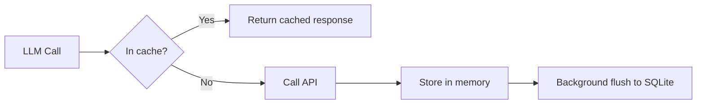

# Response Caching

AgentOpt caches LLM responses at the HTTP level to avoid redundant API calls during model selection.

## How It Works



| Property | Detail |
|:---------|:-------|
| **Cache key** | SHA-256 of the request body (model + messages + params), excluding `stream` |
| **In-memory** | Thread-safe dict — always active when caching is on |
| **On disk** | Optional SQLite database (`cache.db`), flushed every 10 seconds by a background thread |

Cached responses include the original latency measurement, so cost and latency comparisons remain fair.

## Why It Matters

During model selection, many LLM calls are identical:

!!! example "Shared model calls"
    If two combinations use the same planner model, the planner call for each datapoint is identical. With 9 combinations and 3 distinct planners, you pay for **3** unique planner calls per datapoint — not 9.

!!! example "Re-runs are free"
    Tweak your eval function and re-run? Every LLM call hits the cache. Zero API cost, instant results.

!!! example "Crash recovery"
    If a long run is interrupted, cached responses survive on disk. Resume without re-calling the API.

## Enabling Disk Cache

By default, caching is in-memory only (lost when the process exits). To persist:

```python
from agentopt.proxy import LLMTracker

tracker = LLMTracker(cache_dir="./llm_cache")
selector = BruteForceModelSelector(
    ...,
    tracker=tracker,
)
results = selector.select_best()
# Cache automatically flushed to ./llm_cache/cache.db
```

On subsequent runs with the same `cache_dir`, entries are loaded from disk at startup.

## Cache Lifecycle

| Event | What Happens |
|:------|:-------------|
| `LLMTracker(cache_dir=...)` | Creates DB if needed, loads existing entries into memory |
| LLM call (cache miss) | Response stored in memory, marked dirty |
| Background flush (every 10s) | Dirty entries written to SQLite |
| `tracker.stop()` / `select_best()` returns | Final flush to disk |
| `tracker.clear_cache()` | Clears memory and deletes all DB rows |

## Disabling Cache

```python
tracker = LLMTracker(cache=False)
```

## Inspecting the Cache

The cache is a standard SQLite database:

=== "Count entries"

    ```bash
    sqlite3 ./llm_cache/cache.db "SELECT COUNT(*) FROM cache"
    ```

=== "List models"

    ```bash
    sqlite3 ./llm_cache/cache.db "SELECT DISTINCT json_extract(value, '$.body.model') FROM cache"
    ```

=== "Database size"

    ```bash
    ls -lh ./llm_cache/cache.db
    ```
