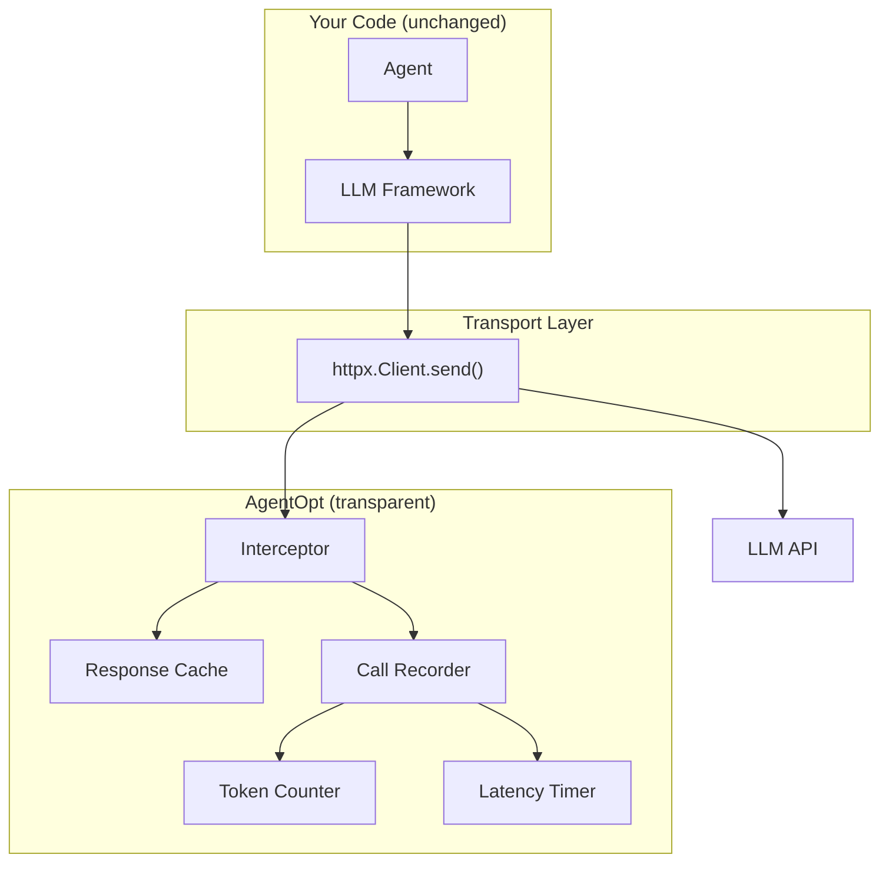

# How It Works

## Architecture Overview



## The Interception Layer

Every major LLM SDK uses `httpx` for HTTP requests. AgentOpt patches `httpx.Client.send()` and `httpx.AsyncClient.send()` at the class level, intercepting every LLM API call transparently:

```
your_agent(input)
  +-- framework internals (LangChain, CrewAI, etc.)
        +-- httpx.Client.send()   <-- intercepted here
              +-- LLM API (OpenAI, Anthropic, etc.)
```

This means:

- **Zero code changes** to your agent or framework
- **No proxy server** to configure
- **Works with any framework** that uses httpx (OpenAI, Anthropic, LangChain, CrewAI, LlamaIndex, AG2, ...)

!!! note "Supported providers"
    Any LLM provider whose SDK uses `httpx` is automatically supported. This includes OpenAI, Anthropic, Google (Gemini), Mistral, Cohere, and any OpenAI-compatible API endpoint.

## What Gets Tracked

For each intercepted call, AgentOpt records:

| Field | Description |
|:------|:------------|
| `model` | Model name (e.g., `gpt-4o`) |
| `prompt_tokens` | Input token count |
| `completion_tokens` | Output token count |
| `latency_seconds` | Wall-clock API call duration |
| `data_id` | Which datapoint triggered this call |
| `combo_id` | Which model combination was being evaluated |
| `cached` | Whether the response was served from cache |

## Attribution with ContextVars

AgentOpt uses Python's `contextvars` to attribute LLM calls to the correct datapoint and model combination. Each thread and async task gets its own context, so **parallel evaluations never interfere**:

```python
with tracker.track(data_id="dp_1", combo_id="gpt4o+haiku"):
    result = agent(input_data)
    # All LLM calls in this block are tagged with dp_1 + gpt4o+haiku
```

This is what makes `parallel=True` safe — concurrent evaluations are fully isolated.

## Response Caching

AgentOpt caches at the HTTP level:

| Property | Detail |
|:---------|:-------|
| **Cache key** | SHA-256 of request body (model + messages + params), excluding `stream` |
| **In-memory** | Thread-safe dict, always active |
| **On disk** | Optional SQLite database, flushed by background thread |

When the same prompt hits the same model, the cached response is returned instantly — preserving the original latency measurement for fair comparisons.

!!! example "Cache savings in practice"
    If two model combinations share the same planner model, the planner call for each datapoint is identical and hits the cache. With 9 combinations and 3 planner models, you only pay for 3 unique planner calls per datapoint — not 9.

## The Selection Loop

For each model combination:

1. **Build** — Instantiate the agent class with the candidate models via `agent(models)`
2. **Run** — Execute the agent on every datapoint in the evaluation dataset
3. **Track** — Record token usage, latency, and cost via the interception layer
4. **Score** — Evaluate each output using `eval_fn(expected, actual)`
5. **Aggregate** — Compute mean accuracy, latency, and estimated cost
6. **Rank** — Sort by accuracy (ties broken by latency), report results

Different [selection algorithms](algorithms.md) vary in how they choose *which* combinations to evaluate, but steps 1-6 are the same for all of them.
