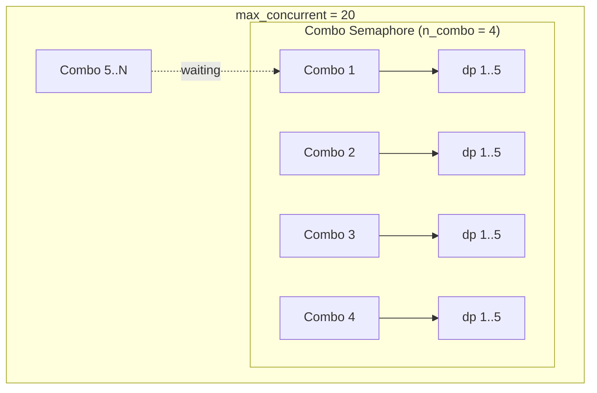

# Parallel Evaluation

When you call `select_best(parallel=True)`, AgentOpt evaluates model combinations concurrently. The `max_concurrent` parameter controls the **total** number of in-flight API calls across all combinations and datapoints.

## The Problem

A naive approach would fire all combinations and all their datapoints at once. With 9 combinations and 100 datapoints each, that's 900 concurrent API calls — enough to hit rate limits and get throttled.

## Two-Level Concurrency

AgentOpt splits `max_concurrent` into two tiers:



| Tier | Controls | Semaphore |
|:-----|:---------|:----------|
| **Outer** (combo) | How many combos run simultaneously | `asyncio.Semaphore(n_combo)` |
| **Inner** (datapoint) | How many datapoints run per combo | `asyncio.Semaphore(dp_concurrent)` |

The invariant: **`n_combo * dp_concurrent <= max_concurrent`**.

## How Slots Are Allocated

The algorithm prioritizes **datapoint parallelism** — it's better to finish one combo quickly than to start many combos slowly:

```
dp_concurrent = min(max_concurrent, batch_size)
n_combo       = max_concurrent // dp_concurrent
```

| `max_concurrent` | `batch_size` | `n_combo` | `dp_concurrent` | Behavior |
|:-----------------|:-------------|:----------|:-----------------|:---------|
| 20 | 5 | 4 | 5 | 4 combos, each with 5 dp in parallel |
| 20 | 100 | 1 | 20 | 1 combo at a time, 20 dp in parallel |
| 20 | 1 | 20 | 1 | 20 combos, 1 dp each (bandit algorithms) |
| 10 | 10 | 1 | 10 | All slots to a single combo's datapoints |

!!! info "Bandit algorithms"
    Bandit-style selectors (Arm Elimination, Threshold SE, Epsilon-LUCB) often evaluate one datapoint at a time per round (`batch_size=1`). In this case, all `max_concurrent` slots go to running combos in parallel — which is exactly what you want for round-by-round elimination.

## Per-Algorithm Behavior

Each selector recomputes concurrency limits at the appropriate granularity:

| Selector | When recomputed | Notes |
|:---------|:----------------|:------|
| **Brute Force** | Once | Full dataset, fixed batch size |
| **Random Search** | Once | Same as brute force on sampled combos |
| **Hill Climbing** | Per iteration | Recomputed for each neighbor batch |
| **Arm Elimination** | Per round | Batch size grows each round |
| **Threshold SE** | Init + per round | Init batch, then batch_size=1 |
| **Epsilon-LUCB** | Init + per round | Same pattern as Threshold SE |
| **Bayesian Optimization** | Per BO batch | Recomputed for each acquisition batch |

## Usage

```python
# Default: 20 total concurrent API calls
results = selector.select_best(parallel=True)

# Increase for high rate limits
results = selector.select_best(parallel=True, max_concurrent=50)

# Conservative: avoid rate limits
results = selector.select_best(parallel=True, max_concurrent=5)
```

!!! tip "Choosing `max_concurrent`"
    Start with the default (20). If you hit rate limits, lower it. If you have high rate limits (e.g., tier 4+ OpenAI), increase it. The two-level split ensures you won't accidentally fire `combos * datapoints` calls simultaneously regardless of the value.
