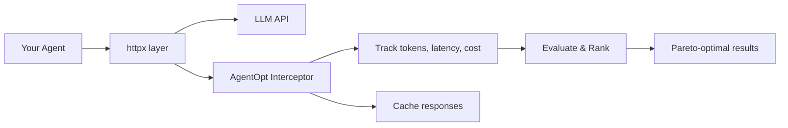

---
hide:
  - navigation
  - toc
---

<div class="hero" markdown>

# AgentOpt

<p class="tagline">
Stop guessing which LLM to use. AgentOpt evaluates model combinations for your AI agents and shows you the Pareto curve of accuracy, cost, and latency tradeoffs.
</p>

<div class="actions" markdown>

[Get Started](getting-started/quickstart.md){ .md-button .md-button--primary }
[View on GitHub :fontawesome-brands-github:](https://github.com/AgentOptimizer/agentopt){ .md-button }

</div>

</div>

---

## The Problem

Your agent has multiple steps — planning, reasoning, tool use, synthesis. Each step could use a different model. With 5 candidate models across 3 steps, that's **125 combinations**. Testing them manually is impractical. Picking blindly leaves performance (and money) on the table.

## The Solution

Give AgentOpt your agent and a small evaluation dataset (~100 samples). It efficiently searches the model combination space and reports the **Pareto-optimal tradeoffs** — so you can choose the right balance of accuracy, cost, and latency for your use case.

```python
from agentopt import BruteForceModelSelector

selector = BruteForceModelSelector(
    agent_fn=agent_maker,
    models={
        "planner": ["gpt-4o", "gpt-4o-mini", "gpt-4.1-nano"],
        "solver":  ["gpt-4o", "gpt-4o-mini", "gpt-4.1-nano"],
    },
    eval_fn=eval_fn,
    dataset=dataset,
)

results = selector.select_best(parallel=True)
results.print_summary()
```

<div class="output-block">
<pre>
    Model Selection Results
    --------------------------------------------------------------------------
    Rank  Model                                       Accuracy  Latency    Price
    --------------------------------------------------------------------------
<span class="highlight-row">&gt;&gt;&gt;  1  planner=gpt-4.1-nano + solver=gpt-4.1-nano   100.00%    0.85s  $0.000420</span>
     2  planner=gpt-4o-mini + solver=gpt-4o-mini      100.00%    1.20s  $0.002372
     3  planner=gpt-4o + solver=gpt-4o                 100.00%    2.70s  $0.014355
    ...
</pre>
</div>

---

## Why AgentOpt

<div class="grid" markdown>

<div class="card" markdown>
<div class="card-icon">:material-code-not-equal-variant:</div>

### Non-Intrusive

Wrap your agent in a factory function. No framework adapters, no SDK wrappers, no code changes to your agent internals.
</div>

<div class="card" markdown>
<div class="card-icon">:material-puzzle-outline:</div>

### Framework-Agnostic

Works with OpenAI, LangChain, LangGraph, CrewAI, LlamaIndex, AG2 — any framework that calls LLMs over HTTP.
</div>

<div class="card" markdown>
<div class="card-icon">:material-chart-scatter-plot:</div>

### Smart Search

7 algorithms from brute force to Bayesian optimization. Search spaces with thousands of combinations without evaluating them all.
</div>

<div class="card" markdown>
<div class="card-icon">:material-radar:</div>

### Automatic Tracking

Transparently intercepts all LLM calls to measure tokens, latency, and cost. No manual instrumentation needed.
</div>

<div class="card" markdown>
<div class="card-icon">:material-cached:</div>

### Response Caching

Identical LLM calls are cached in-memory and on disk (SQLite). Re-running experiments is instant and free.
</div>

<div class="card" markdown>
<div class="card-icon">:material-speedometer:</div>

### Parallel Evaluation

Evaluate model combinations concurrently with configurable concurrency limits. Get results faster.
</div>

</div>

---

## How It Works



AgentOpt patches `httpx` at the transport level — the same HTTP library used by every major LLM SDK. Your agent code stays untouched. AgentOpt silently records every LLM call, caches responses, and aggregates metrics per model combination.

[:octicons-arrow-right-24: Learn more about the architecture](concepts/how-it-works.md)

---

## Selection Algorithms

| Algorithm | Strategy | Best For |
|:----------|:---------|:---------|
| **Brute Force** | Evaluate all combinations | Small spaces (< 50 combos) |
| **Random Search** | Random sampling | Quick baselines |
| **Hill Climbing** | Greedy + restarts | Medium spaces with model topology |
| **Arm Elimination** | Progressive pruning | Statistical early stopping |
| **Hyperband** | Multi-bracket halving | Large spaces, limited budget |
| **LM Proposal** | LLM-guided shortlist | Leveraging model knowledge |
| **Bayesian Optimization** | Gaussian Process | Expensive evaluations |

[:octicons-arrow-right-24: Compare algorithms in detail](concepts/algorithms.md)

---

## Get Started

<div class="grid" markdown>

<div class="card" markdown>

### :material-download: Install

```bash
pip install agentopt
```

[:octicons-arrow-right-24: Installation guide](getting-started/installation.md)
</div>

<div class="card" markdown>

### :material-rocket-launch: Quick Start

Build and optimize your first agent in 5 minutes.

[:octicons-arrow-right-24: Quick start tutorial](getting-started/quickstart.md)
</div>

<div class="card" markdown>

### :material-book-open-variant: Examples

Framework-specific examples for OpenAI, LangChain, CrewAI, and LlamaIndex.

[:octicons-arrow-right-24: Browse examples](examples/openai.md)
</div>

<div class="card" markdown>

### :material-api: API Reference

Full reference for selectors, results, and the tracker.

[:octicons-arrow-right-24: API docs](api/selectors.md)
</div>

</div>
