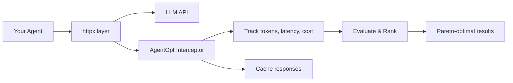

---
hide:
  - navigation
  - toc
  - footer
---

<section class="ao-hero" markdown>
<canvas id="ao-hero-canvas"></canvas>

<div class="ao-hero-inner" markdown>

<p class="ao-eyebrow">
<span class="ao-eyebrow-rule"></span>
Client-side agent optimization
<span class="ao-eyebrow-rule"></span>
</p>

# Choosing the right model for your agents can save <span class="ao-accent">10x money and time</span>

<p class="ao-sub">
AgentOpt evaluates model combinations across your full agent pipeline and converges on the Pareto frontier of accuracy, cost, and latency.
</p>

<div class="ao-ctas" markdown>

[Get started](getting-started/quickstart.md){ .md-button .md-button--primary }
[:fontawesome-brands-github: View on GitHub](https://github.com/AgentOptimizer/agentopt){ .md-button }

</div>

</div>

<div class="ao-stats">
<div class="ao-stat">
<div class="ao-stat-num"><span class="ao-accent">Exponential</span></div>
<div class="ao-stat-label">combo space</div>
</div>
<div class="ao-stat">
<div class="ao-stat-num">Smart search</div>
<div class="ao-stat-label">on best model combination</div>
</div>
<div class="ao-stat">
<div class="ao-stat-num">0</div>
<div class="ao-stat-label">code changes</div>
</div>
<div class="ao-stat">
<div class="ao-stat-num">any</div>
<div class="ao-stat-label">agent framework</div>
</div>
</div>

</section>

---

## The Problem

Your agent has multiple steps — planning, reasoning, tool use, synthesis. Each step could use a different model. With 5 candidate models across 3 steps, that's **125 combinations**. Testing them manually is impractical. Picking blindly leaves performance (and money) on the table.

## The Solution

Give AgentOpt your agent and a small evaluation dataset (~100 samples). It efficiently searches the model combination space and reports the **Pareto-optimal tradeoffs** — so you can choose the right balance of accuracy, cost, and latency for your use case.

```python
from agentopt import BruteForceModelSelector

selector = BruteForceModelSelector(
    agent_fn=agent_maker,
    models={
        "planner": ["gpt-4o", "gpt-4o-mini", "gpt-4.1-nano"],
        "solver":  ["gpt-4o", "gpt-4o-mini", "gpt-4.1-nano"],
    },
    eval_fn=eval_fn,
    dataset=dataset,
)

results = selector.select_best(parallel=True)
results.print_summary()
```

<div class="output-block">
<pre>
    Model Selection Results
    --------------------------------------------------------------------------
    Rank  Model                                       Accuracy  Latency    Price
    --------------------------------------------------------------------------
<span class="highlight-row">&gt;&gt;&gt;  1  planner=gpt-4.1-nano + solver=gpt-4.1-nano   100.00%    0.85s  $0.000420</span>
     2  planner=gpt-4o-mini + solver=gpt-4o-mini      100.00%    1.20s  $0.002372
     3  planner=gpt-4o + solver=gpt-4o                 100.00%    2.70s  $0.014355
    ...
</pre>
</div>

---

## Why AgentOpt

<div class="grid cards" markdown>

-   :material-code-not-equal-variant:{ .lg .middle } **Non-Intrusive**

    ---

    Wrap your agent in a factory function. No framework adapters, no SDK wrappers, no code changes to your agent internals.

-   :material-puzzle-outline:{ .lg .middle } **Framework-Agnostic**

    ---

    Works with OpenAI, LangChain, LangGraph, CrewAI, LlamaIndex, AG2 — any framework that calls LLMs over HTTP.

-   :material-chart-scatter-plot:{ .lg .middle } **Smart Search**

    ---

    6 algorithms from brute force to Bayesian optimization. Search spaces with thousands of combinations without evaluating them all.

-   :material-radar:{ .lg .middle } **Automatic Tracking**

    ---

    Transparently intercepts all LLM calls to measure tokens, latency, and cost. No manual instrumentation needed.

-   :material-cached:{ .lg .middle } **Response Caching**

    ---

    Identical LLM calls are cached in-memory and on disk (SQLite). Re-running experiments is instant and free.

-   :material-speedometer:{ .lg .middle } **Parallel Evaluation**

    ---

    Evaluate model combinations concurrently with configurable concurrency limits. Get results faster.

</div>

---

## How It Works



AgentOpt patches `httpx` at the transport level — the same HTTP library used by every major LLM SDK. Your agent code stays untouched. AgentOpt silently records every LLM call, caches responses, and aggregates metrics per model combination.

[:octicons-arrow-right-24: Learn more about the architecture](concepts/how-it-works.md)

---

## Selection Algorithms

| Algorithm | Strategy | Best For |
|:----------|:---------|:---------|
| **Brute Force** | Evaluate all combinations | Small spaces (< 50 combos) |
| **Random Search** | Random sampling | Quick baselines |
| **Hill Climbing** | Greedy + restarts | Medium spaces with model topology |
| **Arm Elimination** | Progressive pruning | Statistical early stopping |
| **LM Proposal** | LLM-guided shortlist | Leveraging model knowledge |
| **Bayesian Optimization** | Gaussian Process | Expensive evaluations |

[:octicons-arrow-right-24: Compare algorithms in detail](concepts/algorithms.md)

---

## Get Started

<div class="grid cards" markdown>

-   :material-download:{ .lg .middle } **Install**

    ---

    ```bash
    pip install agentopt
    ```

    [:octicons-arrow-right-24: Installation guide](getting-started/installation.md)

-   :material-rocket-launch:{ .lg .middle } **Quick Start**

    ---

    Build and optimize your first agent in 5 minutes.

    [:octicons-arrow-right-24: Quick start tutorial](getting-started/quickstart.md)

-   :material-book-open-variant:{ .lg .middle } **Examples**

    ---

    Framework-specific examples for OpenAI, LangChain, CrewAI, and LlamaIndex.

    [:octicons-arrow-right-24: Browse examples](examples/openai.md)

-   :material-api:{ .lg .middle } **API Reference**

    ---

    Full reference for selectors, results, and the tracker.

    [:octicons-arrow-right-24: API docs](api/selectors.md)

</div>
